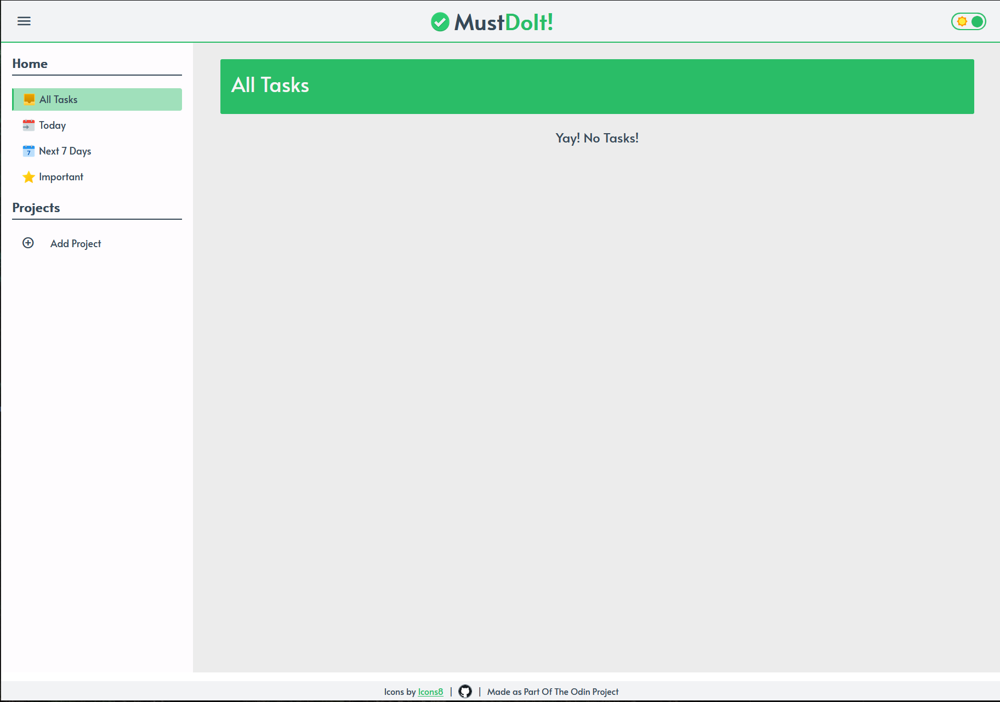

# // MustDoIt: Productivity App

Keep track of tasks with custom project folders and notes.

This is a Basic Todo-List
using date-fns package
Check out live preview here: 
[Live App](https://jet-black-ninja.github.io/to-do-list/dist/index.html)

Functionality:-

    - add and rename projects
    - change order of projects using drag and drop feature
    - temporarily hide side panel
    - add tasks into your projects (title, details, due-date)
    - mark or un-mark your tasks as completed or important
    - edit you tasks (title, details, due-date)
    - delete you tasks
    - display all tasks
    - display all tasks that is due today
    - display all tasks that is due until next week
    - display all tasks that are marked important
    - save all you projects and task to localStorage
    - light & Dark mode

Feature ideas to implement.

- Create logins and allow shared projects / notes between users.

